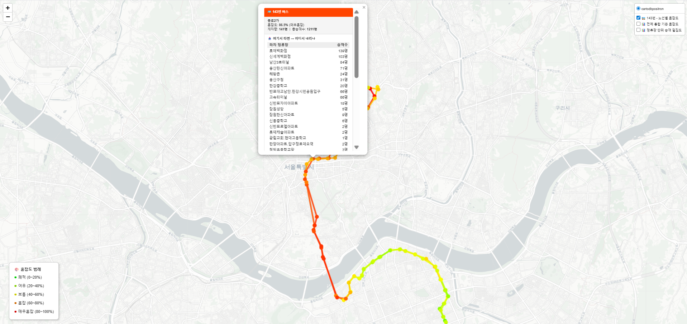

# SeoulTransitPlatform

[](https://github.com/Ianx2933/SeoulTransitPlatform/actions/workflows/ci.yml)

A geospatial transit demand platform that turns raw smart-card records into
stop-, station-, and district-level demand analysis for the Seoul metropolitan
area.

It exists because the source data does not answer questions directly. Roughly
10M daily transactions arrive with missing route identifiers, inconsistent stop
codes, and incomplete origin-destination records. The platform reconstructs
usable OD flows from that, then serves spatial demand queries on top.

**What it was used to find:** a congested segment that justified a targeted
short-turn bus service, a route segment whose demand pattern argued for
splitting it into a local service, and three routes carrying over half their
demand on a single core segment. See
**[policy insights](docs/analysis/policy_insights.md)**.



## Highlights

| | |
|---|---|
| **Query performance** | District-demand endpoint reduced from ~10 s to 192 ms cold — [analysis](docs/performance/phase6_9_2_district_demand_optimization.md) |
| **Data correction** | Four-stage OD identifier recovery plus a separate three-stage coordinate matcher with per-row method/confidence provenance |
| **Spatial stack** | PostGIS with GIST, composite, and expression indexes over 1,208 administrative boundaries |
| **Reproducibility** | Schema scripts + Docker Compose; automated tests use synthetic fixtures; model binaries excluded by design |

## Current phase status

| Phase | Status | Summary |
|---|---:|---|
| Phase 6.8 | Done | Node-centered map demand analysis and catchment API |
| Phase 6.9 | Done | District-centered all-route demand analysis |
| Phase 6.9-2 | Done | District-demand performance indexing and statistics refresh |
| Phase 6.10 | Done | Deployment readiness — schema scripts, runbooks, profiles, smoke tests, container images |
| Phase 7 | Planned | GCP deployment architecture and implementation |

## Key capabilities

- Node-centered demand lookup around a coordinate radius.
- District-centered demand aggregation by administrative dong.
- Bus and subway mode filtering.
- Weekday/day-type and hour filtering.
- Route, node, and district-level demand summaries.
- Redis cache by default for deployment parity.
- Caffeine cache through `local-simple` profile for lightweight local execution.
- PostgreSQL/PostGIS spatial lookup and performance indexes.

## Tech stack

| Layer | Technology |
|---|---|
| Backend API | Spring Boot, Java 21, Maven |
| Database | PostgreSQL, PostGIS |
| Cache | Redis, Caffeine |
| Prediction service | Python, Flask, XGBoost |
| Frontend | React, Vite, Leaflet |
| Pipelines | Python, Airflow |
| Local infra | Docker Compose |
| Testing | pytest, JUnit 5, Testcontainers/PostGIS, Vitest, GitHub Actions |

## Local quick start

All commands run from the repository root unless stated otherwise. Examples use
PowerShell; CMD and bash equivalents are in the
[local runbook](docs/deployment/local_runbook.md).

### 0. Create the database schema

Required on first run. The API server uses `ddl-auto: validate` and will not
start against an empty database.

```bash
psql -h localhost -p 5432 -U postgres -c "CREATE DATABASE \"Seoul_Transit\" ENCODING 'UTF8';"
psql -h localhost -p 5432 -U postgres -d Seoul_Transit -f database/schema/run_all.sql
```

This creates structure only; endpoints return empty results until data is
loaded. Full instructions, including data loading order and Windows-specific
psql setup, are in
[`docs/deployment/database_setup.md`](docs/deployment/database_setup.md).

### 1. Start infrastructure

```powershell
copy .env.example .env
```

Fill in `DB_PASSWORD` and `ADMIN_API_TOKEN`, then:

```powershell
docker compose up -d
docker exec -it seoul-transit-redis redis-cli ping
```

Expected Redis response:

```text
PONG
```

### 2. Start the API server

```powershell
cd services\api-server

$env:DB_PASSWORD='your-local-postgres-password'
$env:ADMIN_API_TOKEN='local-dev-token'
$env:JPA_DDL_AUTO='validate'
$env:CACHE_TYPE='redis'
$env:REDIS_HOST='localhost'
$env:REDIS_PORT='6379'

mvn spring-boot:run
```

Or run the whole stack in containers after placing the prediction model
artifacts described in `services/prediction-service/README.md`:

```powershell
docker compose --profile app up -d
```

### 3. Run smoke tests

```powershell
curl.exe -i 'http://localhost:8080/actuator/health'

curl.exe -i 'http://localhost:8080/api/map/node-catchment?lat=37.5&lng=127.03&radiusMeters=800&modes=bus,subway&dayTypes=mon&dayAggregation=average&hours=8'

curl.exe -i 'http://localhost:8080/api/map/district-demand?districtCode=11230760&modes=bus,subway&dayTypes=mon,tue,wed,thu,fri&dayAggregation=average&hours=7,8,9&nodeLimit=50'
```

Expected health result:

```text
HTTP/1.1 200
{"status":"UP"}
```

Full request examples and timing interpretation are in
[`docs/deployment/smoke_tests.md`](docs/deployment/smoke_tests.md).

### 4. Start the frontend

```powershell
cd services\web-client

npm.cmd install
npm.cmd run dev
```

Default Vite URL:

```text
http://localhost:5173
```

## Cache profiles

| Profile | Cache | Intended use |
|---|---|---|
| default | Redis | Local Redis and deployment-like execution |
| local-simple | Caffeine | Lightweight local execution without Redis |
| test | Testcontainers Redis/PostGIS | Automated tests |

Run the API without Redis:

```powershell
cd services\api-server

$env:SPRING_PROFILES_ACTIVE='local-simple'
$env:DB_PASSWORD='your-local-postgres-password'
$env:ADMIN_API_TOKEN='local-dev-token'
$env:JPA_DDL_AUTO='validate'

mvn spring-boot:run
```

With the default profile and no Redis running, `/actuator/health` reports
`DOWN`. That is a missing dependency, not a broken build — see
[`docs/architecture/cache_profiles.md`](docs/architecture/cache_profiles.md).


## Tests

The repository treats tests as executable engineering contracts rather than a
coverage-number exercise. The highest-value cases lock down fallback precedence,
ambiguity handling, provenance, record-cardinality preservation, coordinate
validation, prediction distribution totals, API input/error contracts, and
PostGIS boundary semantics.

Python pipeline and prediction-service tests:

```bash
python -m pip install -r requirements-test.txt
pytest -q
```

Backend tests include unit coverage for `OccupancyCalculator` and
`MapDemandService`, MVC-slice 400/404 response contracts, and repository
integration tests. Docker must be available for the shared PostGIS/Redis
Testcontainers context. The PostGIS fixture includes a stop exactly on an
administrative-district boundary and verifies that `ST_Covers` includes it
without changing aggregate totals when `nodeLimit` is applied.

```bash
cd services/api-server
./mvnw test
```

Frontend tests:

```bash
cd services/web-client
npm ci
npm test
```

CI runs all three layers on every push to `main` and on pull requests. See
[`docs/engineering/testing_strategy.md`](docs/engineering/testing_strategy.md)
for the rationale and the highest-value invariants.

## Performance result: Phase 6.9-2

The district-demand endpoint was previously measured at roughly 9.5-12.9
seconds on local runs. Profiling identified two causes: spatial joins running
without GIST support, and identifier comparisons normalised with `LPAD` that no
plain btree index could serve.

Adding spatial, composite, and expression indexes and refreshing table
statistics brought cold calls below one second, with a best observed local
result of about 192 ms.

| Baseline | After | Approximate improvement |
|---:|---:|---:|
| 9.5 s | 0.192 s | about 49x |
| 12.9 s | 0.192 s | about 67x |

A precomputed node-to-district mapping table was considered and deliberately
not built — indexing was sufficient, and the table would have needed rebuilding
whenever stop locations or boundaries changed.

Index SQL: `database/performance/phase6_9_2_district_demand_indexes.sql`
Analysis: [`docs/performance/phase6_9_2_district_demand_optimization.md`](docs/performance/phase6_9_2_district_demand_optimization.md)

## Documentation

| File | Purpose |
|---|---|
| [`docs/analysis/policy_insights.md`](docs/analysis/policy_insights.md) | Transit policy findings derived from OD analysis |
| [`docs/architecture/overview.md`](docs/architecture/overview.md) | Project background, system design, pipeline, target GCP architecture |
| [`docs/architecture/map_demand_api.md`](docs/architecture/map_demand_api.md) | Map demand endpoint reference |
| [`docs/architecture/cache_profiles.md`](docs/architecture/cache_profiles.md) | Redis/Caffeine/Testcontainers cache profiles |
| [`docs/architecture/target_architecture.md`](docs/architecture/target_architecture.md) | Domain-oriented package refactoring design |
| [`docs/deployment/database_setup.md`](docs/deployment/database_setup.md) | Database creation, schema, and data loading order |
| [`docs/deployment/local_runbook.md`](docs/deployment/local_runbook.md) | Local execution runbook |
| [`docs/deployment/smoke_tests.md`](docs/deployment/smoke_tests.md) | API smoke test commands and expected results |
| [`docs/performance/phase6_9_2_district_demand_optimization.md`](docs/performance/phase6_9_2_district_demand_optimization.md) | 6.9-2 performance analysis |
| [`docs/engineering/testing_strategy.md`](docs/engineering/testing_strategy.md) | Test philosophy, invariants, PostGIS integration tests, and CI |
| [`docs/changelog/`](docs/changelog/) | Change records and predecessor project artefacts |

## Repository layout

```text
database/schema/        Schema creation scripts, run in numeric order
database/performance/   Performance index scripts
docs/                   Documentation (see table above)
pipelines/              Python data pipelines by phase
tests/                  pytest contracts for matching and OD correction
.github/workflows/       CI for Python, backend/PostGIS, and frontend tests
pipelines/airflow/      Airflow DAGs
scripts/db/             Data loading helper scripts
services/api-server/    Spring Boot API
services/prediction-service/  Flask prediction service
services/web-client/    React/Vite/Leaflet frontend
```

## Security notes

Do not commit local secrets.

Never commit:

```text
.env
real DB_PASSWORD values
real ADMIN_API_TOKEN values
real SEOUL_BUS_API_KEY values
PostgreSQL passwords
```

Use `.env.example` for placeholders only, and session-level environment
variables for local development.

## Known gaps

Tracked here so they are visible rather than discovered during deployment.

1. `admin_dong_boundary` has no loader script — it is imported manually with
   ogr2ogr, documented in
   `database/schema/04_reference_admin_dong_boundary.sql`.
2. `bus_stop_location` and `subway_station_location` have not been compared
   against the live database; the remaining schema files have. See the
   verification table in `docs/deployment/database_setup.md`.
3. Reference CSVs are not committed. Sources and required columns are listed in
   section 4.0 of `docs/deployment/database_setup.md`.
4. Prediction binary model artifacts are intentionally excluded; retraining and
   expected artifact names are documented in `services/prediction-service/README.md`.

## Next work

1. Phase 7 — GCP deployment (Cloud Run, Cloud SQL, Artifact Registry, Secret
   Manager). The container images and compose stack built in Phase 6.10 are the
   input to this.
2. Schedule the existing hourly loader from Airflow; only the correction DAG is
   migrated so far.
3. Extend OD analysis toward trip-chain analysis — transfer patterns and
   full journey flows rather than single-leg boarding and alighting.
