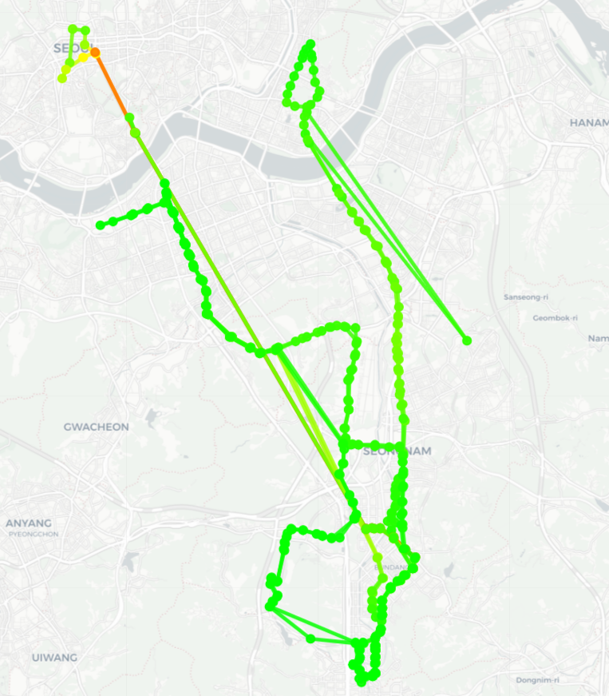
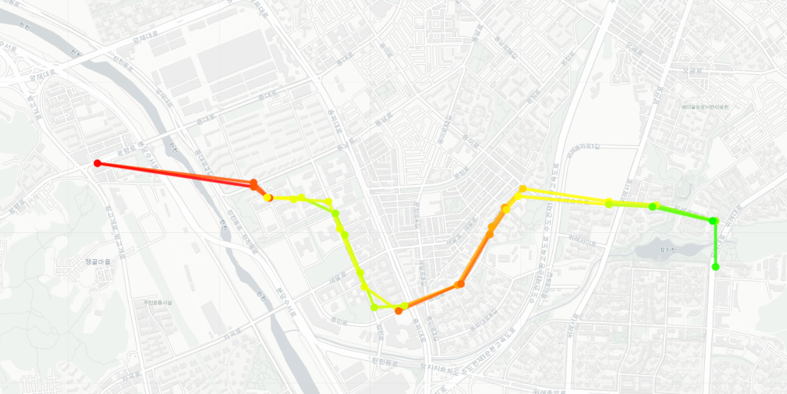
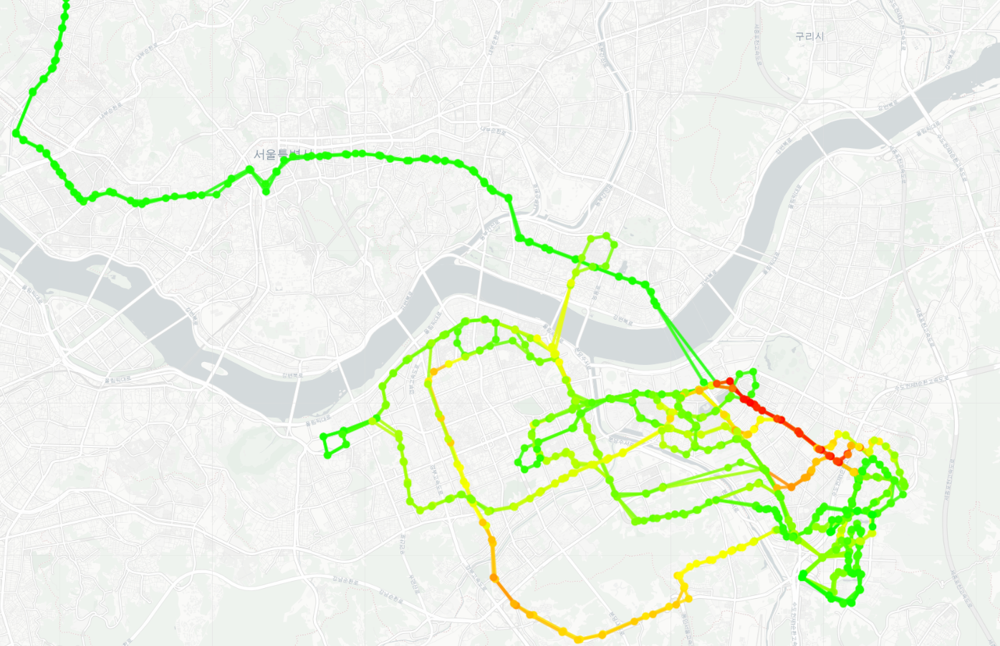
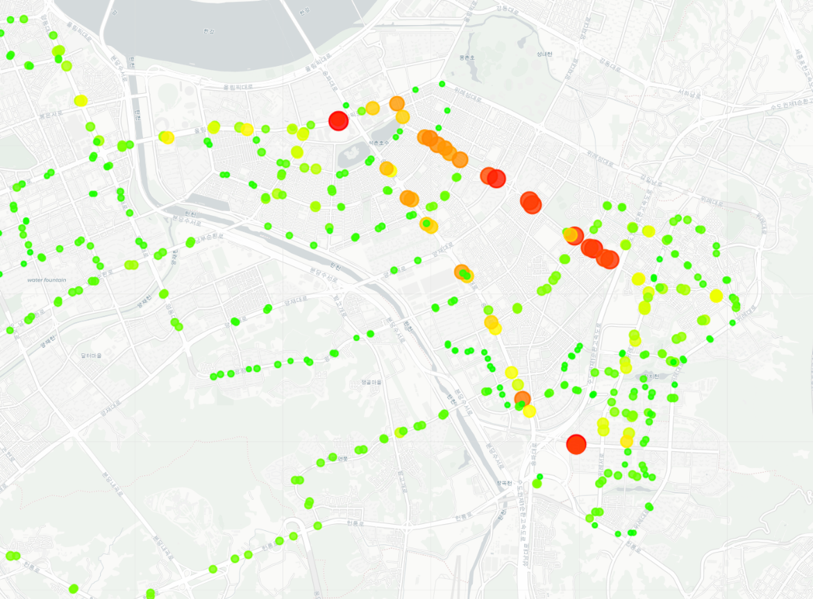
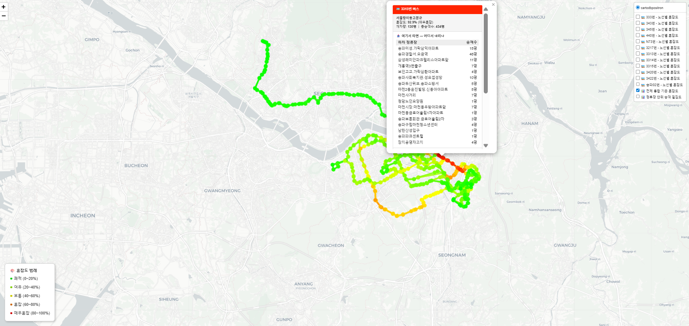

# Policy Insights from OD Analysis

Findings from Seoul and Gyeonggi bus origin-destination data that translate
into concrete transit policy recommendations.

These results come from the analysis phase that preceded this platform. The
platform exists to make this kind of analysis repeatable rather than one-off.

## Method

| Step | Approach |
|---|---|
| Data | Bus smart card OD records, corrected through the four-stage pipeline |
| Congestion metric | Cumulative onboard passengers per segment, normalized to vehicle capacity |
| Segmentation | Filtered by route, stop sequence, and direction |
| Validation | Cross-checked against known complaint patterns and existing service |

Congestion grades used throughout:

| Grade | Load factor | Colour |
|---|---|---|
| Comfortable | 0–20% | Green |
| Light | 20–40% | Light green |
| Moderate | 40–60% | Yellow |
| Crowded | 60–80% | Orange |
| Severely crowded | 80–100% | Red |

---

## 1. Route 143 — case for targeted short-turn service

Segment: Jongno 2-ga → Express Bus Terminal (종로2가 – 고속터미널)

The segment registers as severely crowded across the full length of route 143,
and it is a segment with a known history of passenger complaints.

**Findings**

- Highest load factor of any segment on route 143.
- Standard full-size buses alone do not cover peak demand on this stretch.
- Demand is concentrated in commuting hours rather than spread across the day.

**Recommendation**

Introduce a *daramjwi* bus — a short-turn service that runs only the congested
segment at concentrated headways during peak hours — rather than increasing
frequency across the entire route. This targets capacity where the load is
without adding vehicle-hours on segments that are already comfortable.

---

## 2. Routes 302 / 303 — case for splitting a segment into a local service

Routes 302 and 303 share most of their alignment but diverge between
Sangdaewon depot and Seongho Market (상대원차고지 ~ 성호시장). Alighting demand
on that non-overlapping segment was analysed to determine whether it serves
Seoul-bound trips or local Seongnam trips.

**Alighting passengers by stop**

| Stop | Sequence | Alighting |
|---|---:|---:|
| Seongnam Medical Center / Sinheung 1-dong Center | 19 | **390** |
| Seongnam Sports Complex / Seongnam-dong Center | 15 | 191 |
| Seongil Middle-High School | 16 | 161 |
| Jungang Market | 21 | 139 |
| Seongho Market Entrance | 18 | 132 |
| Jungwon-gu Office | 14 | 74 |
| Daeha Elementary / Jungwon Youth Center | 10 | 60 |
| Artenville Rear Gate | 11 | 48 |

**Threshold used**

Korean transit agencies and academic practice treat a transfer volume above
**50 passengers** at a single point as the level at which service complaints
can no longer be handled case by case — it becomes a structural service
question.

**Findings**

- Demand concentrates in the top three stops, all of which are Seongnam civic
  and institutional destinations rather than Seoul-bound transfer points.
- Demand drops sharply after Jungang Market (sequence 21).
- The pattern indicates a Seongnam local travel market, not a Seoul commuting
  market.

**Recommendation**

Operate the Sangdaewon depot → Jungang Market segment as a Gyeonggi local bus
service, separate from the Seoul-bound trunk route. Truncating route 302 at
Bokjeong Station and running Bokjeong ↔ Sangwangsimni would raise operating
efficiency relative to the current alignment.

---

## 3. Demand concentration — quantifying the case for route restructuring

OD records were filtered by segment to measure what share of each route's total
demand falls on its core segment.

**Routes 303 and 302**

| Route | Segment | Passengers | Share of route total |
|---|---|---:|---:|
| 303 | Sangdaewon ↔ Jamsil Stn (both directions) | 14,319 | **56.3%** |
| 303 | Sangdaewon ↔ Statistics Korea / Taepyeong Stn | 4,939 | 19.4% |
| 302 | Sangdaewon ↔ Jamsil Stn (both directions) | 9,559 | **51.2%** |
| 302 | Sangdaewon ↔ Statistics Korea / Taepyeong Stn | 3,404 | 18.2% |

**Route 4425**

| Route | Segment | Passengers | Share of route total |
|---|---|---:|---:|
| 4425 | Sangdaewon ↔ Bokjeong Stn | 2,264 | 28.6% |
| 4425 | Eungok Village ↔ Samseong Stn (both directions) | 4,457 | **56.3%** |

**Findings**

All three routes carry more than half their demand on a single core segment.
This cuts two ways, and both are actionable:

- The core segment justifies added frequency on evidence rather than on
  complaint volume.
- The remaining segments carry demand thin enough that restructuring or
  truncation can be argued from the same dataset.

---

## Supporting visualisations

### Network-wide congestion

Congestion across all analysed routes, graded green through red by segment
load factor.

### Songpa 02 — directional asymmetry

A community shuttle route showing congestion concentrated in specific
segments, with load differing by direction of travel. Asymmetric patterns like
this matter for scheduling: capacity added in both directions would be wasted
on the lighter one.

### Wirye district — corridor versus interior

Routes serving Wirye New Town. Load rises along the Ogeum-ro corridor toward
Geoyeo and Jamsil, while demand inside the new town itself stays low — a
pattern that argues against adding interior circulation before the corridor is
addressed.

### Wirye district — stop-level density

Total onboard passengers per stop across all routes, sized and coloured by
volume. This view surfaces transfer hubs and primary destinations that
route-by-route views obscure.

### OD inspection interface

Clicking a stop shows its OD breakdown; the layer panel toggles routes
independently. This per-stop OD view is the entry point for trip-chain
analysis.

---

## Extension: trip-chain analysis

OD analysis is the first stage of trip-chain analysis. The current results
describe boarding and alighting patterns for a single route on a single day.
The same data supports:

| Direction | What it would show |
|---|---|
| Time-of-day analysis | Peak versus midday patterns — the basis for flexible headway policy |
| Transfer patterns | Which stops and which route pairs generate the most transfers |
| Individual journey flows | Full origin-to-destination paths as a single trip rather than separate legs |
| Restricted-access data | Transfer patterns and rider-type raw data, available only through Korea's data safe zone under privacy law |

The platform in this repository implements the first of these: hourly demand by
stop, station, and administrative district. See
[`docs/architecture/overview.md`](../architecture/overview.md).

---

## Related work

A separate project for Yongin City applied the same approach — spatial data as
the basis for a policy recommendation — to river and urban planning. It
combined drone photogrammetry (Pix4D with custom OpenCV feature matching for
segments the commercial pipeline could not resolve), a game-engine digital twin
placing the resulting 3D mesh in city context, and spatial analysis of resident
survey responses to identify preferred public space. The proposal received a
city award.

That work is not published here: its code and data are owned by the
municipality and carry security restrictions.
